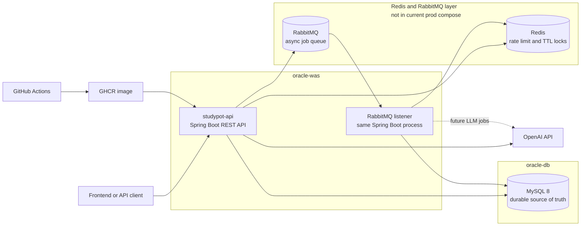

# Architecture Map

## Project
- Name: `AI Study Leader`
- Repo: `/Users/hyunwoo/Developer/Projects/StudyPot`
- Stack: `Java 21 + Gradle + Spring Boot`

## Map
- Root package: `com.studypot.aistudyleader`
- Global common code:
  - `global.api`: API path and cursor pagination response contracts.
  - `global.application`: application-layer common contracts such as `UseCase`.
  - `global.domain`: framework-free base types such as `AggregateRoot`, `AuditMetadata`, `DomainEvent`, and `UuidV7`.
  - `global.error`: RFC 7807 `ProblemDetail` factory and validation exception handling.
  - `global.persistence`: persistence helpers such as UUID binary conversion.
  - `global.security`: stateless Spring Security scaffold with ProblemDetail authentication/authorization failures.
- Bounded contexts:
  - `auth`
  - `studygroup`
  - `onboarding`
  - `curriculum`
  - `weeklytodo`
  - `retrospective`
  - `ai`
  - `notification`
- Meeting/session specific packages are post-MVP unless a new Change Request and ADR reintroduce them.
- Each bounded context uses a domain-oriented layered package structure:
  - `controller`: REST controllers and request/response DTO mapping.
  - `service`: business/application flow, commands, results, and service-facing ports.
  - `domain`: entities, value objects, domain services, and domain events. No Spring, service, repository, controller, or infrastructure dependencies.
  - `repository`: repository contracts and database-backed implementations.
  - `infrastructure`: external technical integrations such as OAuth providers, JWT, external APIs, files, messaging, and provider configuration.

## Runtime Infrastructure Boundary
- Approved by [CR-20260519-redis-rabbitmq-realtime-infra](../specs/change-requests/CR-20260519-redis-rabbitmq-realtime-infra.md) and [ADR-20260519-redis-rabbitmq-realtime-infra](../specs/adr/ADR-20260519-redis-rabbitmq-realtime-infra.md).
- MySQL is the durable source of truth for business state, AI audit, notification state, idempotency, retry count, redacted failure, and read state.
- Redis owns short-lived rate limit counters and TTL duplicate locks only.
- RabbitMQ owns asynchronous dispatch, worker isolation, retry handoff, and broker dead-letter boundaries only.
- The current RabbitMQ listener runs inside the same Spring Boot application process when enabled. A separate `studypot-worker` container is a later deployment task.
- Current production compose runs only `studypot-api`; Redis and RabbitMQ are not part of `deploy/docker-compose.prod.yml`.

## Guardrails
- Prefer existing patterns over new abstractions.
- Keep tests close to changed behavior.
- Record cross-module decisions in `EXEC_PLAN -> Doc Notes`.
- `LayeredArchitectureTest` enforces domain/service/repository dependency direction, production controller placement, and removal of legacy `adapter` package naming.
