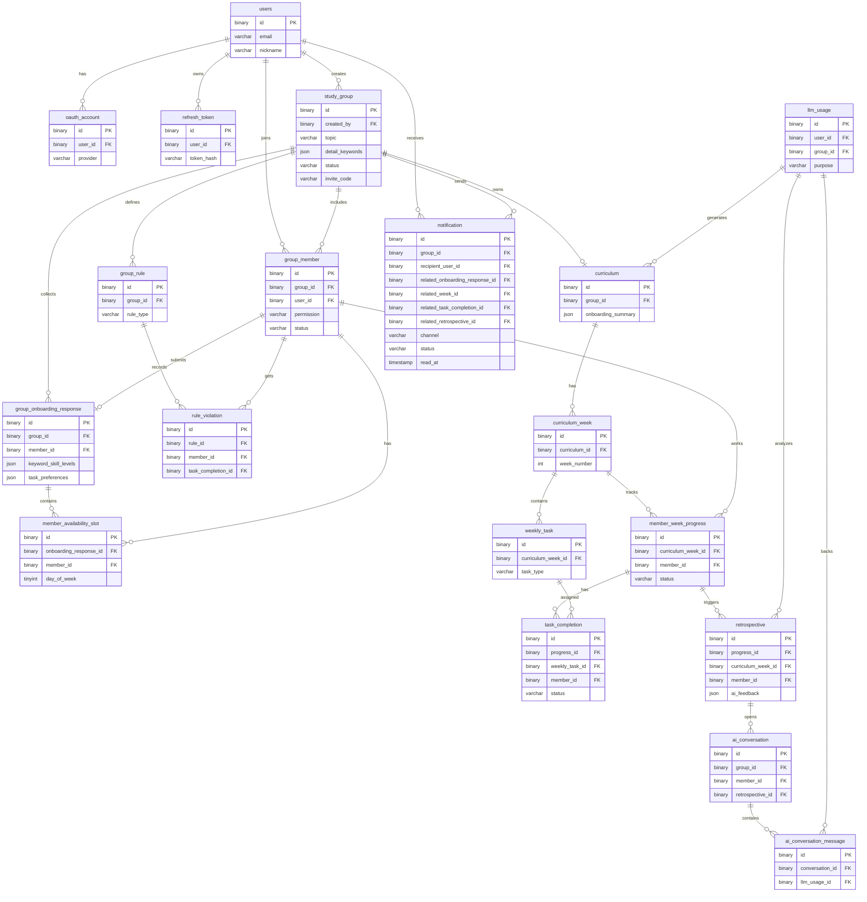

# 04 ERD / 데이터 모델

## Entity Set
- Identity/Auth: `users`, `oauth_account`, `refresh_token`
- Group/Onboarding/Rules: `study_group`, `group_member`, `group_onboarding_response`, `member_availability_slot`, `group_rule`, `rule_violation`
- Curriculum/Todo: `curriculum`, `curriculum_week`, `weekly_task`, `member_week_progress`, `task_completion`
- AI/Retrospective: `retrospective`, `ai_conversation`, `ai_conversation_message`, `llm_usage`
- Operations: `notification`

## Mermaid

## MySQL8 Baseline
- UUIDv7 as `BINARY(16)`.
- Structured context as `JSON`.
- Timestamps as `TIMESTAMP(6)`.
- Schema draft: `docs/specs/db-schema-v1.sql`.
- Discord integration and external delivery channels are not MVP entities.
