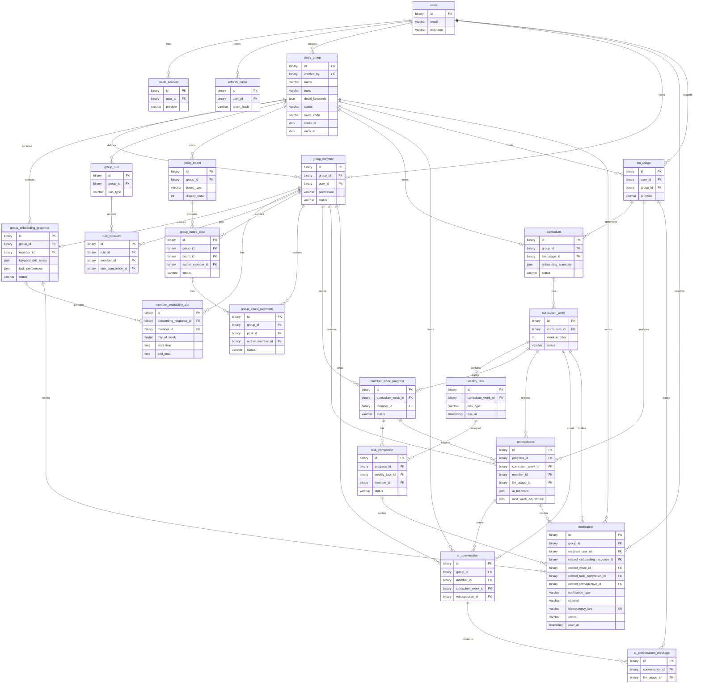

# 04 ERD / 데이터 모델

## 문서 상태
- Jira: `SPT-6`
- Lock status: `LOCKED_FOR_IMPLEMENTATION`
- Source of truth: `docs/specs/domain-erd.md`
- DB contract: `docs/specs/db-contract-v1.md`
- DDL draft: `docs/specs/db-schema-v1.sql`
- Approved changes: `CR-20260430-onboarding-mysql8-mvp`, `CR-20260504-no-discord-inapp-notification`, `CR-20260601-study-group-board-api`
- 변경 규칙: 테이블, 컬럼, FK, enum, JSON shape, notification behavior 변경은 Change Request + ADR 필요

## 설계 기준
- Primary database는 MySQL8이다.
- 애플리케이션이 UUIDv7을 생성하고, DB에는 `BINARY(16)`으로 저장한다.
- AI/context처럼 유연한 구조는 MySQL `JSON`으로 저장한다.
- MVP는 최종 선택/직접 입력된 detail keyword만 저장하고, 임시 AI 추천 후보는 저장하지 않는다.
- 호스트 시작 시점에 제출된 온보딩 응답만 초기 커리큘럼 생성에 사용한다.
- 늦게 합류한 멤버의 온보딩은 전체 초기 커리큘럼 자동 재생성이 아니라 향후 주차 조정에 반영한다.
- MVP 알림은 서비스 내부 `IN_APP`이며 Discord와 외부 채널은 후속 CR/ADR 이후 확장한다.
- Redis/RabbitMQ runtime boundary는 `CR-20260519-redis-rabbitmq-realtime-infra`와 `ADR-20260519-redis-rabbitmq-realtime-infra`가 승인한다. Redis는 TTL 기반 rate limit/lock 상태만, RabbitMQ는 async dispatch/DLQ boundary만 소유하며 durable AI/notification state는 MySQL에 남는다.
- meeting-centered table은 P0에서 제외한다.

## Entity Set
| Group | Tables | Feature IDs |
| --- | --- | --- |
| Identity/Auth | `users`, `oauth_account`, `refresh_token` | `identity-core` |
| Group/Onboarding/Rules | `study_group`, `group_member`, `group_onboarding_response`, `member_availability_slot`, `group_rule`, `rule_violation` | `study-group-core`, `group-onboarding`, `weekly-todo` |
| Group Board | `group_board`, `group_board_post`, `group_board_comment` | `study-group-board` |
| Curriculum/Todo | `curriculum`, `curriculum_week`, `weekly_task`, `member_week_progress`, `task_completion` | `curriculum-core`, `weekly-todo` |
| AI/Retrospective | `retrospective`, `ai_conversation`, `ai_conversation_message`, `llm_usage` | `retrospective-feedback`, `ai-team-leader` |
| Operations | `notification` | `notification` |

## 핵심 데이터 흐름
1. `users` authenticates through `oauth_account` and owns `refresh_token`.
2. Host creates `study_group`; owner/member relationship is stored in `group_member`.
3. Host and members submit `group_onboarding_response` plus `member_availability_slot`.
4. Host start creates one `curriculum`, multiple `curriculum_week`, and ordered `weekly_task` rows.
5. Weekly execution writes `member_week_progress` and `task_completion`.
6. Group collaboration writes `group_board`, `group_board_post`, and `group_board_comment`.
7. AI feedback writes `retrospective`, `ai_conversation`, `ai_conversation_message`, and `llm_usage`.
8. User-facing reminders and feedback alerts are recorded in `notification` with recipient/read state.

## Mermaid

## MySQL8 Baseline
- UUIDv7 as `BINARY(16)`.
- Structured context as `JSON`.
- Timestamps as `TIMESTAMP(6)`.
- Schema draft: `docs/specs/db-schema-v1.sql`.
- Discord integration and external delivery channels are not MVP entities.

## Locked Status Values
| Field | Values |
| --- | --- |
| `study_group.status` | `DRAFT`, `ONBOARDING`, `ACTIVE`, `COMPLETED`, `ARCHIVED` |
| `group_member.permission` | `OWNER`, `MEMBER` |
| `group_member.status` | `PENDING_ONBOARDING`, `ACTIVE`, `LEFT` |
| `group_onboarding_response.status` | `DRAFT`, `SUBMITTED` |
| `group_board.board_type` | `NOTICE`, `QUESTION`, `RESOURCE`, `RETROSPECTIVE` |
| `group_board_post.status` | `PUBLISHED`, `DELETED` |
| `group_board_comment.status` | `PUBLISHED`, `DELETED` |
| `curriculum.status` | `DRAFT`, `ACTIVE`, `COMPLETED` |
| `curriculum_week.status` | `PENDING`, `IN_PROGRESS`, `COMPLETED` |
| `weekly_task.task_type` | `READING`, `PRACTICE`, `ASSIGNMENT`, `PROJECT`, `CUSTOM` |
| `member_week_progress.status` | `NOT_STARTED`, `IN_PROGRESS`, `COMPLETED`, `INCOMPLETE`, `FEEDBACK_READY` |
| `task_completion.status` | `TODO`, `DONE`, `INCOMPLETE`, `SKIPPED` |
| `retrospective.status` | `PENDING`, `PROCESSING`, `COMPLETED`, `FAILED` |
| `ai_conversation.conversation_type` | `TEAM_LEAD_CHAT`, `RETROSPECTIVE` |
| `notification.channel` | `IN_APP` |
| `notification.status` | `PENDING`, `DELIVERED`, `READ`, `FAILED`, `SKIPPED` |
| `llm_usage.status` | `SUCCESS`, `FAILED`, `TIMEOUT` |

## JSON Fields
| Field | Contents |
| --- | --- |
| `study_group.detail_keywords` | Final selected or directly entered keyword strings. |
| `group_onboarding_response.keyword_skill_levels` | Internal object keyed by detail keyword, value 1 to 5. Public onboarding maps one `skillLevel` to this object. |
| `group_onboarding_response.task_preferences` | Compatibility object. Simplified public onboarding stores `{}` until a later approved task reintroduces task preference input. |
| `curriculum.onboarding_summary` | Submitted onboarding response summary used at host start. |
| `curriculum_week.learning_goals` | Ordered learning goals. |
| `curriculum_week.resources` | Recommended resources. |
| `weekly_task.source_payload` | AI generation context excerpt. |
| `retrospective.input_summary` | Progress and incomplete reason summary. |
| `retrospective.ai_feedback` | AI team leader feedback. |
| `retrospective.next_week_adjustment` | Future week/task adjustment proposal. |
| `notification.payload` | In-app notification metadata and deep-link context. |
| `llm_usage.request_payload` | Redacted request metadata. |

## Constraint Notes
- `study_group.starts_at` must be before or equal to `study_group.ends_at`.
- `study_group.max_members` must be positive.
- `group_member` has one membership row per user/group.
- Public onboarding writes one `skillLevel`; service code stores it as keyword score JSON and stores `task_preferences` as an empty compatibility object.
- `member_availability_slot.end_time` must be greater than `start_time`.
- `curriculum_week.week_number` is unique per curriculum.
- `group_board.board_type` is unique per live group.
- `group_board_post` and `group_board_comment` use `PUBLISHED -> DELETED` soft delete status.
- `weekly_task.display_order` is unique per curriculum week.
- `task_completion` is unique per weekly task/member.
- `notification.idempotency_key` prevents duplicate in-app notification rows.

## Hot Query Expectations
- Fetch current user groups by `group_member.user_id`, member status, and group status.
- Fetch onboarding completion by `study_group.id`.
- Fetch availability slots by group or member.
- Fetch active curriculum and current week by group.
- Fetch weekly tasks and member task completion by week/member.
- Find overdue tasks and incomplete reasons for in-app notification workers.
- Fetch retrospective by progress/week/member.
- Fetch unread notifications by recipient user.
- Fetch group boards, board posts, and post comments by group with cursor pagination.
- Aggregate LLM usage by group, user, purpose, and UTC date.

## Deferred Tables
| Table | Reason |
| --- | --- |
| `study_session` and attendance/note/action tables | Meeting-centered MVP was replaced by asynchronous onboarding/todo/retrospective flow. |
| `study_group_invitation` | MVP can store invite code on `study_group`; add table when invite audit/expiry is required. |
| `rule_version` | Rule version history is post-MVP. |
| `notification_preference` | Member preferences can be added after baseline in-app notification works. |
| External notification channel tables | Discord, email, push, or Kakao delivery is post-MVP. |
| Board reaction, mention, attachment, and search index tables | Board MVP starts with durable posts/comments only. |

## 추적 링크
- Repo ERD: `docs/specs/domain-erd.md`
- DB contract: `docs/specs/db-contract-v1.md`
- DDL draft: `docs/specs/db-schema-v1.sql`
- Notification contract: `docs/specs/notification-contract-v1.md`
- Jira: `SPT-6`
