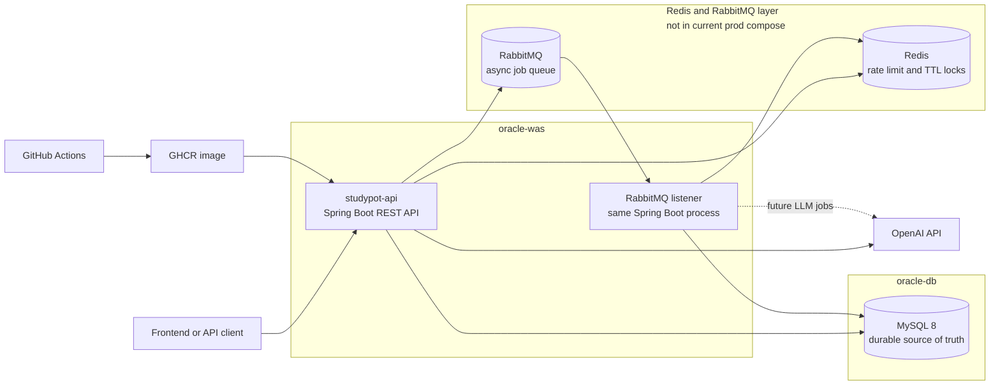

# ADR-20260519 Redis RabbitMQ Realtime Infra Boundary

## Status
- Approved

## Context
- SPT-78 added Redis-backed rate limiting and documented Redis as short-lived protection state.
- SPT-84 added RabbitMQ-backed notification dispatch and a worker listener behind disabled-by-default configuration.
- The locked v1 plan stores durable AI, retrospective, conversation, curriculum, notification, and `llm_usage` state in MySQL.
- The current production deployment document says `oracle-was` runs only the Spring Boot API container and `oracle-db` runs MySQL 8.
- Redis Pub/Sub, Redis Streams, Kafka, a separate worker container, and later LLM/RAG service splits remain possible follow-up choices, but they need a stable boundary before more implementation tasks are started.

## Decision
- MySQL remains the durable source of truth for StudyPot business records, AI audit records, notification records, idempotency keys, retry counts, redacted failures, and read state.
- Redis is the short-lived protection layer. It owns rate limit counters, burst-control state, and future duplicate generation locks with TTL. Redis must not own final AI results, notification state, user-visible read state, or durable audit data.
- RabbitMQ is the asynchronous dispatch layer. It owns job delivery, worker isolation, retry handoff, and broker dead-letter boundaries. RabbitMQ must not own final notification status, AI results, or business audit data.
- The current RabbitMQ listener runs inside the same Spring Boot application process. A later `studypot-worker` service may reuse the same application image with worker-only settings, but that split is not approved by this ADR.
- The current production deployment remains `oracle-was` API-only and `oracle-db` MySQL-only. This ADR does not add Redis or RabbitMQ services to `deploy/docker-compose.prod.yml`.
- Production Redis/RabbitMQ activation requires a later deployment task that records capacity checks, placement choice, compose/env pass-through, credentials, actuator health settings, rollback behavior, and smoke verification.
- Kafka remains deferred. Redis Pub/Sub and Redis Streams remain post-MVP comparison topics unless a later task approves a concrete realtime feature.
- FastAPI, vector store, GraphRAG, MCP, and broader LLM agent service-split choices remain deferred to SPT-82 or later approved tasks.

## Runtime Shape

## Consequences
- Positive: Future Redis, RabbitMQ, Pub/Sub, Streams, Kafka, and worker tasks can compare alternatives without reassigning durable ownership away from MySQL.
- Positive: `oracle-was` stays protected from accidental extra container load until a deployment task proves capacity and health behavior.
- Positive: The same-process RabbitMQ listener keeps SPT-84 operationally simple while leaving a later worker-container split open.
- Positive: AI and notification code can use asynchronous dispatch without losing auditability, idempotency, or failure inspection.
- Negative: Production Redis/RabbitMQ is not enabled by this ADR; another task is required before using the code-level integrations in production.
- Negative: A separate worker container, managed broker, private network placement, or broker DLQ policy still needs concrete deployment work.
- Migration or compatibility notes: No DB migration, OpenAPI change, enum change, or new service is required. Existing defaults keep Redis/RabbitMQ paths disabled unless explicitly enabled.

## Affected Feature IDs
- `n/a-harness`
- `identity-core`
- `curriculum-core`
- `retrospective-feedback`
- `ai-team-leader`
- `notification`

## Affected Documents
- `docs/specs/change-control-v1.md`
- `docs/specs/ai-contract-v1.md`
- `docs/specs/notification-contract-v1.md`
- `docs/specs/feature-coverage-matrix.md`
- `docs/architecture/backend-map.md`
- `docs/operations/local-development.md`
- `docs/operations/deployment.md`
- `docs/confluence/00-doc-hub.md`
- `docs/confluence/04-erd-data-model.md`
- `docs/confluence/06-ai-team-leader.md`

## Linked Change Request
- [CR-20260519-redis-rabbitmq-realtime-infra](../change-requests/CR-20260519-redis-rabbitmq-realtime-infra.md)
