# AI Study Leader Domain ERD

## Provenance
- Captured from the Claude share discussion provided by the user:
  - `https://claude.ai/share/8872bb8c-2666-4000-9c22-fa369d279f50`
- This is the current source-of-truth ERD planning document for backend schema work.
- Mirror summary lives in Obsidian:
  - `01 Specs/Domain ERD Notes.md`

## ERD Decision Summary
- Primary database: PostgreSQL.
- Primary key strategy: UUIDv7 for all application tables.
- Delete strategy: soft delete through `deleted_at`.
- Audit columns: every mutable business table has `created_at`, `updated_at`, and `deleted_at`.
- Flexible structured fields: JSONB for group rules, meeting note payloads, AI run metadata, and notification payloads.
- Identity model: core user identity, OAuth accounts, and Discord accounts are separate.
- Discord model: Discord IDs never live directly on core study tables.
- Group rules: stored as `study_groups.rules JSONB` for MVP. A dedicated rules-history table is deferred until rule versioning is required.
- Final MVP entity count: 18 tables.

## Entity List
| No. | Table | Feature Area | Purpose |
| --- | --- | --- | --- |
| 1 | `users` | `identity-core` | Core application identity. |
| 2 | `user_oauth_accounts` | `identity-core` | OAuth provider account links. |
| 3 | `user_discord_accounts` | `identity-core`, `discord-notifications` | Discord identity links. |
| 4 | `study_groups` | `study-group-core`, `study-group-rules` | Study team, schedule defaults, and JSONB rules. |
| 5 | `study_group_members` | `study-group-core` | User membership and role inside a group. |
| 6 | `study_group_invitations` | `study-group-core` | Invite lifecycle for joining groups. |
| 7 | `study_sessions` | `study-session-core` | Scheduled or completed study meetings. |
| 8 | `study_session_attendance` | `study-session-core` | Member-level attendance for sessions. |
| 9 | `study_session_notes` | `structured-notes` | Structured meeting notes from members or the group. |
| 10 | `study_session_action_items` | `structured-notes`, `ai-feedback-report` | Follow-up tasks from notes or AI feedback. |
| 11 | `study_goals` | `study-group-core` | Group or member learning goals. |
| 12 | `member_progress_logs` | `structured-notes` | Progress snapshots tied to members, goals, or sessions. |
| 13 | `study_resources` | `study-group-core` | Shared links, documents, or references. |
| 14 | `ai_prompt_runs` | `ai-prep-brief`, `ai-feedback-report` | Raw AI run input/output metadata and traceability. |
| 15 | `ai_preparation_briefs` | `ai-prep-brief` | Pre-session AI agenda and preparation output. |
| 16 | `ai_feedback_reports` | `ai-feedback-report` | Post-session group or member feedback output. |
| 17 | `discord_notification_channels` | `discord-notifications` | Group-level Discord notification destinations. |
| 18 | `discord_notification_logs` | `discord-notifications` | Delivery history for Discord notifications. |

## Relationship Diagram

```mermaid
erDiagram
    users {
        uuid id PK
        string email
        string display_name
        string avatar_url
        string timezone
        string status
        timestamptz last_login_at
        timestamptz created_at
        timestamptz updated_at
        timestamptz deleted_at
    }

    user_oauth_accounts {
        uuid id PK
        uuid user_id FK
        string provider
        string provider_user_id
        string provider_email
        jsonb provider_profile
        timestamptz linked_at
        timestamptz created_at
        timestamptz updated_at
        timestamptz deleted_at
    }

    user_discord_accounts {
        uuid id PK
        uuid user_id FK
        string discord_user_id
        string username
        string global_name
        string avatar_url
        boolean is_primary
        timestamptz linked_at
        timestamptz created_at
        timestamptz updated_at
        timestamptz deleted_at
    }

    study_groups {
        uuid id PK
        uuid owner_user_id FK
        string name
        string slug
        string description
        string timezone
        string visibility
        string status
        jsonb rules
        jsonb schedule_defaults
        timestamptz created_at
        timestamptz updated_at
        timestamptz deleted_at
    }

    study_group_members {
        uuid id PK
        uuid group_id FK
        uuid user_id FK
        string role
        string status
        timestamptz joined_at
        timestamptz left_at
        jsonb preferences
        timestamptz created_at
        timestamptz updated_at
        timestamptz deleted_at
    }

    study_group_invitations {
        uuid id PK
        uuid group_id FK
        uuid inviter_member_id FK
        uuid accepted_by_user_id FK
        string invitee_email
        string invitee_discord_user_id
        string token_hash
        string role
        string status
        timestamptz expires_at
        timestamptz accepted_at
        timestamptz created_at
        timestamptz updated_at
        timestamptz deleted_at
    }

    study_sessions {
        uuid id PK
        uuid group_id FK
        int sequence_no
        string title
        string status
        timestamptz scheduled_start_at
        timestamptz scheduled_end_at
        timestamptz actual_start_at
        timestamptz actual_end_at
        jsonb agenda
        jsonb meeting_snapshot
        timestamptz created_at
        timestamptz updated_at
        timestamptz deleted_at
    }

    study_session_attendance {
        uuid id PK
        uuid session_id FK
        uuid member_id FK
        string status
        timestamptz checked_in_at
        timestamptz checked_out_at
        string note
        timestamptz created_at
        timestamptz updated_at
        timestamptz deleted_at
    }

    study_session_notes {
        uuid id PK
        uuid session_id FK
        uuid author_member_id FK
        string note_type
        string content
        jsonb structured_payload
        timestamptz submitted_at
        timestamptz created_at
        timestamptz updated_at
        timestamptz deleted_at
    }

    study_session_action_items {
        uuid id PK
        uuid session_id FK
        uuid source_note_id FK
        uuid assigned_member_id FK
        uuid created_by_member_id FK
        string title
        string description
        string status
        date due_date
        jsonb metadata
        timestamptz completed_at
        timestamptz created_at
        timestamptz updated_at
        timestamptz deleted_at
    }

    study_goals {
        uuid id PK
        uuid group_id FK
        uuid owner_member_id FK
        string title
        string description
        string status
        date target_date
        jsonb success_criteria
        timestamptz created_at
        timestamptz updated_at
        timestamptz deleted_at
    }

    member_progress_logs {
        uuid id PK
        uuid member_id FK
        uuid goal_id FK
        uuid session_id FK
        string summary
        jsonb progress_payload
        timestamptz logged_at
        timestamptz created_at
        timestamptz updated_at
        timestamptz deleted_at
    }

    study_resources {
        uuid id PK
        uuid group_id FK
        uuid added_by_member_id FK
        string resource_type
        string title
        string url
        string description
        jsonb metadata
        timestamptz created_at
        timestamptz updated_at
        timestamptz deleted_at
    }

    ai_prompt_runs {
        uuid id PK
        uuid group_id FK
        uuid session_id FK
        uuid requester_member_id FK
        string run_type
        string provider
        string model
        string prompt_version
        string status
        jsonb input_snapshot
        jsonb output_payload
        int input_tokens
        int output_tokens
        string error_code
        string error_message
        timestamptz started_at
        timestamptz completed_at
        timestamptz created_at
        timestamptz updated_at
        timestamptz deleted_at
    }

    ai_preparation_briefs {
        uuid id PK
        uuid session_id FK
        uuid prompt_run_id FK
        int version
        string title
        string summary
        jsonb agenda_items
        jsonb member_prompts
        timestamptz generated_at
        timestamptz created_at
        timestamptz updated_at
        timestamptz deleted_at
    }

    ai_feedback_reports {
        uuid id PK
        uuid session_id FK
        uuid target_member_id FK
        uuid prompt_run_id FK
        int version
        string report_type
        string summary
        jsonb strengths
        jsonb improvements
        jsonb next_actions
        timestamptz generated_at
        timestamptz created_at
        timestamptz updated_at
        timestamptz deleted_at
    }

    discord_notification_channels {
        uuid id PK
        uuid group_id FK
        string discord_guild_id
        string discord_channel_id
        string channel_name
        string status
        jsonb notification_settings
        timestamptz connected_at
        timestamptz created_at
        timestamptz updated_at
        timestamptz deleted_at
    }

    discord_notification_logs {
        uuid id PK
        uuid channel_id FK
        uuid session_id FK
        uuid recipient_user_id FK
        string notification_type
        string status
        string provider_message_id
        jsonb payload
        timestamptz scheduled_for
        timestamptz sent_at
        string error_message
        timestamptz created_at
        timestamptz updated_at
        timestamptz deleted_at
    }

    users ||--o{ user_oauth_accounts : "has"
    users ||--o{ user_discord_accounts : "links"
    users ||--o{ study_group_members : "joins"
    users ||--o{ study_groups : "owns"
    users ||--o{ study_group_invitations : "accepts"
    users ||--o{ discord_notification_logs : "receives"

    study_groups ||--o{ study_group_members : "has"
    study_groups ||--o{ study_group_invitations : "invites"
    study_groups ||--o{ study_sessions : "schedules"
    study_groups ||--o{ study_goals : "tracks"
    study_groups ||--o{ study_resources : "shares"
    study_groups ||--o{ ai_prompt_runs : "runs_ai"
    study_groups ||--o{ discord_notification_channels : "connects"

    study_group_members ||--o{ study_group_invitations : "sends"
    study_group_members ||--o{ study_session_attendance : "attends"
    study_group_members ||--o{ study_session_notes : "writes"
    study_group_members ||--o{ study_session_action_items : "assigned"
    study_group_members ||--o{ study_session_action_items : "creates"
    study_group_members ||--o{ study_goals : "owns"
    study_group_members ||--o{ member_progress_logs : "logs"
    study_group_members ||--o{ study_resources : "adds"
    study_group_members ||--o{ ai_prompt_runs : "requests"
    study_group_members ||--o{ ai_feedback_reports : "targeted"

    study_sessions ||--o{ study_session_attendance : "records"
    study_sessions ||--o{ study_session_notes : "contains"
    study_sessions ||--o{ study_session_action_items : "creates"
    study_sessions ||--o{ member_progress_logs : "summarizes"
    study_sessions ||--o{ ai_prompt_runs : "uses"
    study_sessions ||--o{ ai_preparation_briefs : "prepares"
    study_sessions ||--o{ ai_feedback_reports : "reviews"
    study_sessions ||--o{ discord_notification_logs : "notifies"

    study_session_notes ||--o{ study_session_action_items : "extracts"
    study_goals ||--o{ member_progress_logs : "measures"
    ai_prompt_runs ||--o{ ai_preparation_briefs : "produces"
    ai_prompt_runs ||--o{ ai_feedback_reports : "produces"
    discord_notification_channels ||--o{ discord_notification_logs : "sends"
```


## Table Specifications

### 1. `users`
Core application identity. A user can join multiple study groups.

| Column | Type | Required | Notes |
| --- | --- | --- | --- |
| `id` | uuid | yes | UUIDv7 primary key. |
| `email` | citext | no | Nullable for provider-first signup; unique when present and active. |
| `display_name` | varchar(80) | yes | Public display name. |
| `avatar_url` | text | no | External avatar URL. |
| `timezone` | varchar(64) | yes | Default `Asia/Seoul` unless user chooses another. |
| `status` | varchar(20) | yes | `active`, `inactive`, `blocked`. |
| `last_login_at` | timestamptz | no | Last successful app login. |
| `created_at`, `updated_at`, `deleted_at` | timestamptz | yes/no | Standard audit and soft delete. |

Key constraints:
- `unique(lower(email)) where email is not null and deleted_at is null`
- `status in ('active', 'inactive', 'blocked')`

### 2. `user_oauth_accounts`
External OAuth login accounts. A user can link multiple providers.

| Column | Type | Required | Notes |
| --- | --- | --- | --- |
| `id` | uuid | yes | UUIDv7 primary key. |
| `user_id` | uuid | yes | FK to `users.id`. |
| `provider` | varchar(30) | yes | Example: `google`, `kakao`, `github`. |
| `provider_user_id` | varchar(160) | yes | Stable provider subject ID. |
| `provider_email` | citext | no | Provider email snapshot. |
| `provider_profile` | jsonb | yes | Minimal provider profile snapshot. |
| `linked_at` | timestamptz | yes | When linked. |
| audit columns | timestamptz | yes/no | Standard audit and soft delete. |

Key constraints:
- `unique(provider, provider_user_id) where deleted_at is null`
- `index(user_id) where deleted_at is null`

### 3. `user_discord_accounts`
Discord account links for notification routing and identity matching.

| Column | Type | Required | Notes |
| --- | --- | --- | --- |
| `id` | uuid | yes | UUIDv7 primary key. |
| `user_id` | uuid | yes | FK to `users.id`. |
| `discord_user_id` | varchar(40) | yes | Discord snowflake as string. |
| `username` | varchar(80) | no | Discord username snapshot. |
| `global_name` | varchar(80) | no | Discord display name snapshot. |
| `avatar_url` | text | no | Discord avatar URL. |
| `is_primary` | boolean | yes | Default true for the first link. |
| `linked_at` | timestamptz | yes | When linked. |
| audit columns | timestamptz | yes/no | Standard audit and soft delete. |

Key constraints:
- `unique(discord_user_id) where deleted_at is null`
- `unique(user_id) where is_primary = true and deleted_at is null`

### 4. `study_groups`
Main study team aggregate. MVP group rules live here as JSONB.

| Column | Type | Required | Notes |
| --- | --- | --- | --- |
| `id` | uuid | yes | UUIDv7 primary key. |
| `owner_user_id` | uuid | yes | FK to `users.id`; initial group owner. |
| `name` | varchar(120) | yes | Group name. |
| `slug` | varchar(80) | yes | URL-safe group slug. |
| `description` | text | no | Group description. |
| `timezone` | varchar(64) | yes | Group schedule timezone. |
| `visibility` | varchar(20) | yes | `private`, `invite_only`, `public`. |
| `status` | varchar(20) | yes | `active`, `paused`, `archived`. |
| `rules` | jsonb | yes | Study policy, attendance policy, feedback preferences. |
| `schedule_defaults` | jsonb | yes | Default recurrence, duration, reminders. |
| audit columns | timestamptz | yes/no | Standard audit and soft delete. |

Suggested `rules` shape:
```json
{
  "attendancePolicy": {
    "minimumAttendanceRate": 0.8,
    "lateGraceMinutes": 10
  },
  "meetingPolicy": {
    "requiresPreNote": true,
    "requiresPostNote": true
  },
  "aiFeedbackPolicy": {
    "tone": "direct_but_kind",
    "includeIndividualFeedback": true
  }
}
```

Suggested `schedule_defaults` shape:
```json
{
  "durationMinutes": 90,
  "recurrence": {
    "type": "weekly",
    "daysOfWeek": ["SAT"]
  },
  "reminderOffsetsMinutes": [1440, 60, 10]
}
```

Key constraints:
- `unique(slug) where deleted_at is null`
- `visibility in ('private', 'invite_only', 'public')`
- `status in ('active', 'paused', 'archived')`
- GIN index on `rules`
- GIN index on `schedule_defaults`

### 5. `study_group_members`
Membership join table with role and status.

| Column | Type | Required | Notes |
| --- | --- | --- | --- |
| `id` | uuid | yes | UUIDv7 primary key. |
| `group_id` | uuid | yes | FK to `study_groups.id`. |
| `user_id` | uuid | yes | FK to `users.id`. |
| `role` | varchar(20) | yes | `owner`, `manager`, `member`. |
| `status` | varchar(20) | yes | `active`, `paused`, `left`, `removed`. |
| `joined_at` | timestamptz | yes | When membership started. |
| `left_at` | timestamptz | no | When membership ended. |
| `preferences` | jsonb | yes | Member-specific reminder and AI preferences. |
| audit columns | timestamptz | yes/no | Standard audit and soft delete. |

Key constraints:
- `unique(group_id, user_id) where deleted_at is null`
- `role in ('owner', 'manager', 'member')`
- `status in ('active', 'paused', 'left', 'removed')`
- At least one active owner should exist per active group. Enforce in service logic or deferred DB trigger.

### 6. `study_group_invitations`
Invitations by email, Discord user ID, or token link.

| Column | Type | Required | Notes |
| --- | --- | --- | --- |
| `id` | uuid | yes | UUIDv7 primary key. |
| `group_id` | uuid | yes | FK to `study_groups.id`. |
| `inviter_member_id` | uuid | yes | FK to `study_group_members.id`. |
| `accepted_by_user_id` | uuid | no | FK to `users.id` after acceptance. |
| `invitee_email` | citext | no | Email invite target. |
| `invitee_discord_user_id` | varchar(40) | no | Discord invite target. |
| `token_hash` | varchar(128) | yes | Hashed invite token. |
| `role` | varchar(20) | yes | Role granted on acceptance. |
| `status` | varchar(20) | yes | `pending`, `accepted`, `expired`, `revoked`. |
| `expires_at` | timestamptz | yes | Invite expiry. |
| `accepted_at` | timestamptz | no | Acceptance time. |
| audit columns | timestamptz | yes/no | Standard audit and soft delete. |

Key constraints:
- `unique(token_hash) where deleted_at is null`
- `role in ('manager', 'member')`
- `status in ('pending', 'accepted', 'expired', 'revoked')`
- At least one of `invitee_email` or `invitee_discord_user_id` may be null if link-only invite is supported.

### 7. `study_sessions`
Scheduled study meeting instance.

| Column | Type | Required | Notes |
| --- | --- | --- | --- |
| `id` | uuid | yes | UUIDv7 primary key. |
| `group_id` | uuid | yes | FK to `study_groups.id`. |
| `sequence_no` | int | yes | Group-local session number. |
| `title` | varchar(160) | yes | Session title. |
| `status` | varchar(20) | yes | `scheduled`, `ready`, `in_progress`, `completed`, `cancelled`. |
| `scheduled_start_at` | timestamptz | yes | Planned start. |
| `scheduled_end_at` | timestamptz | yes | Planned end. |
| `actual_start_at` | timestamptz | no | Real start. |
| `actual_end_at` | timestamptz | no | Real end. |
| `agenda` | jsonb | yes | Human or AI agenda. |
| `meeting_snapshot` | jsonb | yes | Snapshot of group rules/member context at scheduling time. |
| audit columns | timestamptz | yes/no | Standard audit and soft delete. |

Key constraints:
- `unique(group_id, sequence_no) where deleted_at is null`
- `scheduled_end_at > scheduled_start_at`
- `actual_end_at is null or actual_start_at is null or actual_end_at >= actual_start_at`
- `status in ('scheduled', 'ready', 'in_progress', 'completed', 'cancelled')`
- Index `(group_id, scheduled_start_at desc) where deleted_at is null`

### 8. `study_session_attendance`
Attendance status per member per session.

| Column | Type | Required | Notes |
| --- | --- | --- | --- |
| `id` | uuid | yes | UUIDv7 primary key. |
| `session_id` | uuid | yes | FK to `study_sessions.id`. |
| `member_id` | uuid | yes | FK to `study_group_members.id`. |
| `status` | varchar(20) | yes | `unknown`, `attending`, `late`, `absent`, `excused`. |
| `checked_in_at` | timestamptz | no | Attendance check-in. |
| `checked_out_at` | timestamptz | no | Attendance check-out. |
| `note` | text | no | Attendance note. |
| audit columns | timestamptz | yes/no | Standard audit and soft delete. |

Key constraints:
- `unique(session_id, member_id) where deleted_at is null`
- `status in ('unknown', 'attending', 'late', 'absent', 'excused')`

### 9. `study_session_notes`
Structured notes from members or group-level notes.

| Column | Type | Required | Notes |
| --- | --- | --- | --- |
| `id` | uuid | yes | UUIDv7 primary key. |
| `session_id` | uuid | yes | FK to `study_sessions.id`. |
| `author_member_id` | uuid | no | FK to `study_group_members.id`; nullable for system/group summary notes. |
| `note_type` | varchar(30) | yes | `pre_note`, `post_note`, `decision`, `blocker`, `summary`. |
| `content` | text | no | Human-readable note body. |
| `structured_payload` | jsonb | yes | Structured note values. |
| `submitted_at` | timestamptz | yes | Submission time. |
| audit columns | timestamptz | yes/no | Standard audit and soft delete. |

Suggested `structured_payload` shape:
```json
{
  "done": ["Solved graph traversal problems"],
  "planned": ["Review dynamic programming"],
  "blockers": ["Need clearer explanation for bitmask DP"],
  "questions": ["When should we use top-down DP?"],
  "decisions": ["Next session focuses on DP patterns"]
}
```

Key constraints:
- `note_type in ('pre_note', 'post_note', 'decision', 'blocker', 'summary')`
- Index `(session_id, note_type) where deleted_at is null`
- GIN index on `structured_payload`

### 10. `study_session_action_items`
Follow-up tasks from notes, humans, or AI feedback.

| Column | Type | Required | Notes |
| --- | --- | --- | --- |
| `id` | uuid | yes | UUIDv7 primary key. |
| `session_id` | uuid | yes | FK to `study_sessions.id`. |
| `source_note_id` | uuid | no | FK to `study_session_notes.id`. |
| `assigned_member_id` | uuid | no | FK to `study_group_members.id`. |
| `created_by_member_id` | uuid | no | FK to `study_group_members.id`; null for system-generated items. |
| `title` | varchar(200) | yes | Task title. |
| `description` | text | no | Task detail. |
| `status` | varchar(20) | yes | `open`, `in_progress`, `done`, `skipped`, `cancelled`. |
| `due_date` | date | no | Due date. |
| `metadata` | jsonb | yes | Source and AI extraction metadata. |
| `completed_at` | timestamptz | no | Completion time. |
| audit columns | timestamptz | yes/no | Standard audit and soft delete. |

Key constraints:
- `status in ('open', 'in_progress', 'done', 'skipped', 'cancelled')`
- Index `(assigned_member_id, status, due_date) where deleted_at is null`
- Index `(session_id, status) where deleted_at is null`

### 11. `study_goals`
Group-level or member-level goals.

| Column | Type | Required | Notes |
| --- | --- | --- | --- |
| `id` | uuid | yes | UUIDv7 primary key. |
| `group_id` | uuid | yes | FK to `study_groups.id`. |
| `owner_member_id` | uuid | no | FK to `study_group_members.id`; null for group goal. |
| `title` | varchar(160) | yes | Goal title. |
| `description` | text | no | Goal description. |
| `status` | varchar(20) | yes | `active`, `paused`, `completed`, `cancelled`. |
| `target_date` | date | no | Target date. |
| `success_criteria` | jsonb | yes | Measurable success criteria. |
| audit columns | timestamptz | yes/no | Standard audit and soft delete. |

Key constraints:
- `status in ('active', 'paused', 'completed', 'cancelled')`
- Index `(group_id, status, target_date) where deleted_at is null`

### 12. `member_progress_logs`
Progress snapshots, usually used by AI feedback and session summaries.

| Column | Type | Required | Notes |
| --- | --- | --- | --- |
| `id` | uuid | yes | UUIDv7 primary key. |
| `member_id` | uuid | yes | FK to `study_group_members.id`. |
| `goal_id` | uuid | no | FK to `study_goals.id`. |
| `session_id` | uuid | no | FK to `study_sessions.id`. |
| `summary` | text | no | Human-readable progress summary. |
| `progress_payload` | jsonb | yes | Structured metrics and evidence. |
| `logged_at` | timestamptz | yes | Progress log time. |
| audit columns | timestamptz | yes/no | Standard audit and soft delete. |

Key constraints:
- Index `(member_id, logged_at desc) where deleted_at is null`
- Index `(goal_id, logged_at desc) where goal_id is not null and deleted_at is null`
- GIN index on `progress_payload`

### 13. `study_resources`
Shared study materials.

| Column | Type | Required | Notes |
| --- | --- | --- | --- |
| `id` | uuid | yes | UUIDv7 primary key. |
| `group_id` | uuid | yes | FK to `study_groups.id`. |
| `added_by_member_id` | uuid | no | FK to `study_group_members.id`. |
| `resource_type` | varchar(30) | yes | `link`, `document`, `book`, `video`, `repo`, `other`. |
| `title` | varchar(180) | yes | Resource title. |
| `url` | text | no | External URL. |
| `description` | text | no | Resource notes. |
| `metadata` | jsonb | yes | Tags, provider metadata, import details. |
| audit columns | timestamptz | yes/no | Standard audit and soft delete. |

Key constraints:
- `resource_type in ('link', 'document', 'book', 'video', 'repo', 'other')`
- Index `(group_id, resource_type) where deleted_at is null`

### 14. `ai_prompt_runs`
Trace table for AI requests and results. This enables debugging and prompt evolution.

| Column | Type | Required | Notes |
| --- | --- | --- | --- |
| `id` | uuid | yes | UUIDv7 primary key. |
| `group_id` | uuid | yes | FK to `study_groups.id`. |
| `session_id` | uuid | no | FK to `study_sessions.id`. |
| `requester_member_id` | uuid | no | FK to `study_group_members.id`; null for scheduled/system runs. |
| `run_type` | varchar(40) | yes | `preparation_brief`, `feedback_report`, `action_item_extraction`, `summary`. |
| `provider` | varchar(40) | yes | AI provider. |
| `model` | varchar(80) | yes | Model name. |
| `prompt_version` | varchar(80) | yes | Internal prompt version. |
| `status` | varchar(20) | yes | `queued`, `running`, `succeeded`, `failed`, `cancelled`. |
| `input_snapshot` | jsonb | yes | Redacted input context snapshot. |
| `output_payload` | jsonb | yes | Raw structured model output. |
| `input_tokens` | int | no | Usage count. |
| `output_tokens` | int | no | Usage count. |
| `error_code` | varchar(80) | no | Provider or app error code. |
| `error_message` | text | no | Redacted error. |
| `started_at`, `completed_at` | timestamptz | no | Runtime window. |
| audit columns | timestamptz | yes/no | Standard audit and soft delete. |

Key constraints:
- `run_type in ('preparation_brief', 'feedback_report', 'action_item_extraction', 'summary')`
- `status in ('queued', 'running', 'succeeded', 'failed', 'cancelled')`
- Index `(group_id, created_at desc) where deleted_at is null`
- Index `(session_id, run_type, created_at desc) where session_id is not null and deleted_at is null`

### 15. `ai_preparation_briefs`
AI output for pre-session preparation.

| Column | Type | Required | Notes |
| --- | --- | --- | --- |
| `id` | uuid | yes | UUIDv7 primary key. |
| `session_id` | uuid | yes | FK to `study_sessions.id`. |
| `prompt_run_id` | uuid | yes | FK to `ai_prompt_runs.id`. |
| `version` | int | yes | Increment per session. |
| `title` | varchar(180) | yes | Brief title. |
| `summary` | text | yes | Human-readable summary. |
| `agenda_items` | jsonb | yes | Ordered agenda items. |
| `member_prompts` | jsonb | yes | Member-specific prep prompts. |
| `generated_at` | timestamptz | yes | Generation time. |
| audit columns | timestamptz | yes/no | Standard audit and soft delete. |

Key constraints:
- `unique(session_id, version) where deleted_at is null`
- `unique(prompt_run_id) where deleted_at is null`
- GIN indexes on `agenda_items` and `member_prompts`

### 16. `ai_feedback_reports`
AI output after a session. Supports both group feedback and member feedback.

| Column | Type | Required | Notes |
| --- | --- | --- | --- |
| `id` | uuid | yes | UUIDv7 primary key. |
| `session_id` | uuid | yes | FK to `study_sessions.id`. |
| `target_member_id` | uuid | no | FK to `study_group_members.id`; null means group report. |
| `prompt_run_id` | uuid | yes | FK to `ai_prompt_runs.id`. |
| `version` | int | yes | Increment per session/report target. |
| `report_type` | varchar(30) | yes | `group`, `individual`. |
| `summary` | text | yes | Human-readable feedback. |
| `strengths` | jsonb | yes | Strength observations. |
| `improvements` | jsonb | yes | Improvement observations. |
| `next_actions` | jsonb | yes | Suggested next actions. |
| `generated_at` | timestamptz | yes | Generation time. |
| audit columns | timestamptz | yes/no | Standard audit and soft delete. |

Key constraints:
- `report_type in ('group', 'individual')`
- `target_member_id is null` when `report_type = 'group'`
- `target_member_id is not null` when `report_type = 'individual'`
- `unique(session_id, report_type, coalesce(target_member_id, '00000000-0000-0000-0000-000000000000'::uuid), version) where deleted_at is null`
- `unique(prompt_run_id) where deleted_at is null`

### 17. `discord_notification_channels`
Notification channel binding for a study group.

| Column | Type | Required | Notes |
| --- | --- | --- | --- |
| `id` | uuid | yes | UUIDv7 primary key. |
| `group_id` | uuid | yes | FK to `study_groups.id`. |
| `discord_guild_id` | varchar(40) | yes | Discord guild snowflake. |
| `discord_channel_id` | varchar(40) | yes | Discord channel snowflake. |
| `channel_name` | varchar(120) | no | Snapshot for admin UI. |
| `status` | varchar(20) | yes | `active`, `disabled`, `revoked`. |
| `notification_settings` | jsonb | yes | Enabled notification types and overrides. |
| `connected_at` | timestamptz | yes | Connected time. |
| audit columns | timestamptz | yes/no | Standard audit and soft delete. |

Key constraints:
- `unique(group_id, discord_channel_id) where deleted_at is null`
- `status in ('active', 'disabled', 'revoked')`
- GIN index on `notification_settings`

### 18. `discord_notification_logs`
Delivery history for Discord notifications.

| Column | Type | Required | Notes |
| --- | --- | --- | --- |
| `id` | uuid | yes | UUIDv7 primary key. |
| `channel_id` | uuid | yes | FK to `discord_notification_channels.id`. |
| `session_id` | uuid | no | FK to `study_sessions.id`. |
| `recipient_user_id` | uuid | no | FK to `users.id`; null for channel-wide messages. |
| `notification_type` | varchar(40) | yes | `session_reminder`, `prep_brief`, `feedback_ready`, `action_item_due`. |
| `status` | varchar(20) | yes | `pending`, `sent`, `failed`, `skipped`. |
| `provider_message_id` | varchar(80) | no | Discord message ID after send. |
| `payload` | jsonb | yes | Redacted outbound payload. |
| `scheduled_for` | timestamptz | no | Planned delivery time. |
| `sent_at` | timestamptz | no | Actual delivery time. |
| `error_message` | text | no | Redacted send failure. |
| audit columns | timestamptz | yes/no | Standard audit and soft delete. |

Key constraints:
- `notification_type in ('session_reminder', 'prep_brief', 'feedback_ready', 'action_item_due')`
- `status in ('pending', 'sent', 'failed', 'skipped')`
- Index `(status, scheduled_for) where deleted_at is null`
- Index `(session_id, notification_type) where session_id is not null and deleted_at is null`

## Cross-Table Integrity Rules
- `study_group_members.group_id` and `study_sessions.group_id` must match when linking attendance, notes, action items, goals, or AI reports through member IDs. Enforce in service logic first; add composite FKs later if needed.
- `study_group_members.status = 'active'` is required for creating new attendance, notes, assigned action items, and individual feedback.
- A `study_session` should not move to `completed` until required member post-notes are either submitted or explicitly skipped by group policy.
- `ai_preparation_briefs.prompt_run_id` must reference an `ai_prompt_runs` row with `run_type = 'preparation_brief'`.
- `ai_feedback_reports.prompt_run_id` must reference an `ai_prompt_runs` row with `run_type = 'feedback_report'`.
- Notification logs should store redacted payloads only. Do not persist secrets or bot tokens.

## Locked PostgreSQL Decisions
- `citext` for case-insensitive email fields.
- UUIDv7 is generated by Spring application code before insert.
- `pgcrypto` is not required by v1 DDL because invite token hashing is performed in application code.

## Deletion And Retention Policy
- User deletion:
  - Soft-delete the `users` row.
  - Preserve historical study records.
  - Redact display fields if privacy requirements demand it.
- Group deletion:
  - Soft-delete the group and prevent new sessions/notifications.
  - Preserve sessions, notes, AI outputs, and notification logs until retention policy is defined.
- Discord unlink:
  - Soft-delete the `user_discord_accounts` row.
  - Disable member-specific Discord routing.
- AI run retention:
  - Keep `ai_prompt_runs` for debugging during MVP.
  - Redact sensitive input snapshots.
  - Default retention target is 180 days for raw input snapshots and 365 days for derived reports unless a later ADR changes it.
- Notification log retention:
  - Default retention target is 180 days unless a later ADR changes it.

## Implementation Order
1. Identity:
   - `users`
   - `user_oauth_accounts`
   - `user_discord_accounts`
2. Study group core:
   - `study_groups`
   - `study_group_members`
   - `study_group_invitations`
3. Study operation:
   - `study_sessions`
   - `study_session_attendance`
   - `study_session_notes`
   - `study_session_action_items`
4. Progress and resources:
   - `study_goals`
   - `member_progress_logs`
   - `study_resources`
5. AI features:
   - `ai_prompt_runs`
   - `ai_preparation_briefs`
   - `ai_feedback_reports`
6. Discord notifications:
   - `discord_notification_channels`
   - `discord_notification_logs`

## Deferred Tables
These are intentionally excluded from MVP ERD to keep the first schema focused.

| Deferred Table | Reason |
| --- | --- |
| `study_group_rule_versions` | Current rules fit in `study_groups.rules JSONB`; add when audit/versioning is required. |
| `recurring_session_templates` | Current recurrence fits in `study_groups.schedule_defaults`; add when per-template scheduling becomes complex. |
| `notification_preferences` | Member-specific preferences currently fit in `study_group_members.preferences`. |
| `uploaded_files` | MVP can use URL-based resources first. |
| `billing_*` | No billing requirement in current product brief. |

## Locked Migration Decisions
- Migration owner: Spring Boot project migrations.
- UUIDv7 owner: Spring application code.
- Group slug mutability: immutable after creation in v1.
- Rejoin behavior: reuse the active soft-deleted membership row by restoring status when the same user rejoins the same group.
- Individual AI feedback privacy: owner and manager can view all reports; a member can view only their own individual report and group reports.
- Discord notification target: channel-only notifications in v1. Direct messages are post-MVP.
