# AI Study Leader Domain ERD

## Lock Status
- Status: `LOCKED_FOR_IMPLEMENTATION`
- Source: ERD v0.8 MySQL8.
- Change record: [CR-20260430-onboarding-mysql8-mvp](./change-requests/CR-20260430-onboarding-mysql8-mvp.md)

## Design Decisions
- Primary database is MySQL8.
- UUIDv7 values are generated by application code and stored as `BINARY(16)`.
- Flexible AI/context fields use MySQL `JSON`.
- The MVP stores final selected detail keywords, not transient AI suggestion candidates.
- Host start uses onboarding responses submitted at that moment.
- Late joiner onboarding is not allowed to automatically regenerate the entire initial curriculum.
- Meeting-centered entities are deferred from P0.

## Entity Groups
| Group | Tables |
| --- | --- |
| Identity/Auth | `users`, `oauth_account`, `refresh_token`, `discord_integration` |
| Group/Onboarding/Rules | `study_group`, `group_member`, `group_onboarding_response`, `member_availability_slot`, `group_rule`, `rule_violation` |
| Curriculum/Todo | `curriculum`, `curriculum_week`, `weekly_task`, `member_week_progress`, `task_completion` |
| AI/Retrospective | `retrospective`, `ai_conversation`, `ai_conversation_message`, `llm_usage` |
| Operations | `notification` |

## Mermaid ERD

```mermaid
erDiagram
    users {
        binary id PK
        varchar email
        varchar email_live_key UK
        varchar nickname
        text profile_image
        text bio
        json interests
        varchar skill_level
        timestamp last_login_at
        timestamp created_at
        timestamp updated_at
        timestamp deleted_at
    }

    oauth_account {
        binary id PK
        binary user_id FK
        varchar provider
        varchar provider_user_id
        varchar provider_account_live_key UK
        varchar email
        text access_token_enc
        text refresh_token_enc
        timestamp token_expires_at
        varchar scope
        timestamp connected_at
        timestamp last_synced_at
        timestamp deleted_at
    }

    refresh_token {
        binary id PK
        binary user_id FK
        varchar token_hash UK
        varchar device_info
        varchar ip_address
        timestamp expires_at
        timestamp revoked_at
        timestamp created_at
    }

    discord_integration {
        binary id PK
        binary user_id FK
        varchar discord_user_id
        varchar discord_username
        varchar discord_user_live_key UK
        text access_token_enc
        text refresh_token_enc
        timestamp token_expires_at
        varchar scope
        timestamp connected_at
        timestamp last_synced_at
        timestamp deleted_at
    }

    study_group {
        binary id PK
        binary created_by FK
        varchar name
        text description
        varchar topic
        json detail_keywords
        varchar level
        varchar status
        int max_members
        boolean is_public
        varchar invite_code UK
        date starts_at
        date ends_at
        timestamp onboarding_started_at
        timestamp started_at
        varchar discord_guild_id
        varchar discord_channel_id
        timestamp created_at
        timestamp updated_at
        timestamp deleted_at
    }

    group_member {
        binary id PK
        binary group_id FK
        binary user_id FK
        varchar permission
        varchar status
        varchar display_name
        timestamp joined_at
        timestamp activated_at
        timestamp left_at
        timestamp created_at
        timestamp updated_at
        timestamp deleted_at
    }

    group_onboarding_response {
        binary id PK
        binary group_id FK
        binary member_id FK
        json keyword_skill_levels
        json task_preferences
        text additional_note
        varchar status
        timestamp submitted_at
        timestamp created_at
        timestamp updated_at
        timestamp deleted_at
    }

    member_availability_slot {
        binary id PK
        binary onboarding_response_id FK
        binary member_id FK
        tinyint day_of_week
        time start_time
        time end_time
        varchar timezone
        timestamp created_at
        timestamp updated_at
        timestamp deleted_at
    }

    group_rule {
        binary id PK
        binary group_id FK
        binary created_by FK
        varchar rule_type
        json config
        text description
        boolean is_active
        timestamp created_at
        timestamp updated_at
        timestamp deleted_at
    }

    rule_violation {
        binary id PK
        binary rule_id FK
        binary member_id FK
        binary task_completion_id FK
        json details
        varchar status
        timestamp resolved_at
        text resolved_note
        timestamp occurred_at
        timestamp created_at
    }

    curriculum {
        binary id PK
        binary group_id FK
        binary llm_usage_id FK
        varchar title
        int total_weeks
        json onboarding_summary
        boolean generated_by_ai
        text generation_prompt
        varchar status
        timestamp created_at
        timestamp updated_at
        timestamp deleted_at
    }

    curriculum_week {
        binary id PK
        binary curriculum_id FK
        int week_number
        varchar title
        text description
        text sprint_goal
        json learning_goals
        json resources
        varchar status
        timestamp starts_at
        timestamp ends_at
        timestamp created_at
        timestamp updated_at
        timestamp deleted_at
    }

    weekly_task {
        binary id PK
        binary curriculum_week_id FK
        int display_order
        varchar task_type
        varchar title
        text description
        boolean required
        timestamp due_at
        boolean generated_by_ai
        json source_payload
        timestamp created_at
        timestamp updated_at
        timestamp deleted_at
    }

    member_week_progress {
        binary id PK
        binary curriculum_week_id FK
        binary member_id FK
        varchar status
        timestamp started_at
        timestamp due_at
        timestamp completed_at
        text completion_note
        text incomplete_reason
        timestamp reason_submitted_at
        timestamp created_at
        timestamp updated_at
    }

    task_completion {
        binary id PK
        binary progress_id FK
        binary weekly_task_id FK
        binary member_id FK
        varchar status
        timestamp due_at
        timestamp completed_at
        text completion_note
        text incomplete_reason
        timestamp reason_submitted_at
        text evidence_url
        timestamp created_at
        timestamp updated_at
    }

    retrospective {
        binary id PK
        binary progress_id FK
        binary curriculum_week_id FK
        binary member_id FK
        binary llm_usage_id FK
        varchar trigger_type
        json input_summary
        json ai_feedback
        json next_week_adjustment
        varchar status
        timestamp requested_at
        timestamp completed_at
        timestamp created_at
        timestamp updated_at
    }

    ai_conversation {
        binary id PK
        binary group_id FK
        binary member_id FK
        binary curriculum_week_id FK
        binary retrospective_id FK
        varchar conversation_type
        varchar status
        text summary
        timestamp opened_at
        timestamp closed_at
        timestamp created_at
        timestamp updated_at
    }

    ai_conversation_message {
        binary id PK
        binary conversation_id FK
        binary llm_usage_id FK
        varchar sender_type
        text content
        json metadata
        timestamp created_at
    }

    notification {
        binary id PK
        binary group_id FK
        binary related_onboarding_response_id FK
        binary related_week_id FK
        binary related_task_completion_id FK
        binary related_retrospective_id FK
        varchar notification_type
        varchar channel
        varchar target_id
        varchar idempotency_key UK
        json payload
        varchar status
        timestamp sent_at
        text error_message
        int retry_count
        timestamp scheduled_at
        timestamp created_at
    }

    llm_usage {
        binary id PK
        binary user_id FK
        binary group_id FK
        varchar purpose
        varchar provider
        varchar model
        int input_tokens
        int output_tokens
        decimal total_cost_usd
        int latency_ms
        varchar status
        varchar error_code
        json request_payload
        text response_summary
        date created_date_utc
        timestamp created_at
    }

    users ||--o{ oauth_account : has
    users ||--o{ refresh_token : owns
    users ||--o| discord_integration : connects
    users ||--o{ study_group : creates
    users ||--o{ group_member : joins
    study_group ||--o{ group_member : includes
    study_group ||--o{ group_onboarding_response : collects
    group_member ||--o| group_onboarding_response : submits
    group_onboarding_response ||--o{ member_availability_slot : contains
    group_member ||--o{ member_availability_slot : has
    study_group ||--o{ group_rule : defines
    group_rule ||--o{ rule_violation : records
    group_member ||--o{ rule_violation : gets
    study_group ||--o| curriculum : owns
    curriculum ||--o{ curriculum_week : has
    curriculum_week ||--o{ weekly_task : contains
    curriculum_week ||--o{ member_week_progress : tracks
    group_member ||--o{ member_week_progress : works
    member_week_progress ||--o{ task_completion : has
    weekly_task ||--o{ task_completion : assigned
    member_week_progress ||--o{ retrospective : triggers
    curriculum_week ||--o{ retrospective : reviews
    group_member ||--o{ retrospective : receives
    study_group ||--o{ ai_conversation : hosts
    group_member ||--o{ ai_conversation : chats
    curriculum_week ||--o{ ai_conversation : about
    retrospective ||--o{ ai_conversation : opens
    ai_conversation ||--o{ ai_conversation_message : contains
    llm_usage ||--o{ curriculum : generates
    llm_usage ||--o{ retrospective : analyzes
    llm_usage ||--o{ ai_conversation_message : backs
    study_group ||--o{ llm_usage : costs
    users ||--o{ llm_usage : triggers
    study_group ||--o{ notification : sends
    group_onboarding_response ||--o{ notification : notifies
    curriculum_week ||--o{ notification : notifies
    task_completion ||--o{ notification : notifies
    retrospective ||--o{ notification : notifies
```

## Constraint Notes
- `study_group.starts_at` must be before or equal to `study_group.ends_at`.
- `study_group.max_members` must be positive.
- `group_member` should have only one active membership per user/group.
- `group_onboarding_response.keyword_skill_levels` and `task_preferences` are validated in service code as 1 to 5 score objects.
- `member_availability_slot.end_time` must be greater than `start_time`.
- `curriculum_week.week_number` is unique per curriculum.
- `weekly_task.display_order` is unique per curriculum week.
- `task_completion` is unique per weekly task/member.
- `notification.idempotency_key` prevents duplicate sends.

## Implementation Notes
- Keep MySQL FK constraints simple and enforce cross-table group consistency in service logic.
- Add generated columns only when hot JSON query evidence exists.
- Do not add meeting tables to MVP migrations without a new Change Request and ADR.
